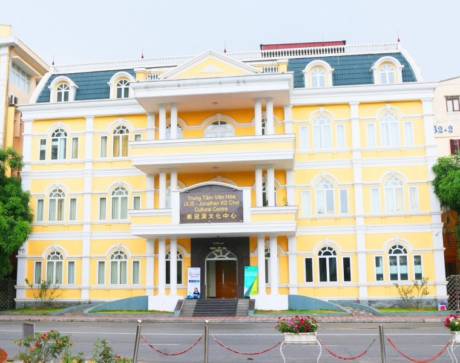

# Jigsaw puzzle solver python

## 1. Cài đặt

```
conda create -n image-processing python=3.6
conda activate image-processing
pip install -r requirements.txt
```

Chạy lệnh `python main.py` để thấy được kết quả

## 2. Demo

### 2.1 Ảnh gốc



### 2.2 Ảnh cut path


### 2.3 Ảnh các mảnh nhỏ


### 2.4 Kết quả


## 3. Hướng giải quyết bài toán

### 3.1 Vẽ đường cắt


- Sau khi tìm hiểu công thức của cô đưa cho, em không hiểu lắm về công thức đó, nên đã quyết định tự làm theo cách của mình
- Đầu tiền em vẽ cách đường ngang và dọc, mỗi ô cắt thành các hình vuông kích thước khoảng xấp xỉ 100x100
- Tiếp đó, mỗi khi đi đến gần giữa đoạn (0,4) đoạn tiến hành vẽ 3 đường tròn
  - Đường tròn to có kích thước gấp 1.3 lần (con số sau khi thử nhiều lần thì thấy ưng mắt, hình nó đẹp và không nhìn trông dị dị
- Vẽ mask, mask bao gồm các đường cắt, mask dùng để phục vụ cho việc cắt ảnh

### 3.2 Cắt ảnh

- Dùng thuật toán dầu loang để tìm tất cả các dãy điểm bao lấy một hình rồi cắt theo

### 3.3 Ghép lại ảnh **có** dùng ảnh gốc

- Đối với trường hợp có dùng ảnh gốc, em sử dụng thuật toán template matching. Kết quả có độ chính xác khá cao. 
- Đối với các viền của các ảnh con có thể dùng trung bình màu giữa 2 viền để trông nó mịn hơn, nhưng do thời gian có hạn nên em đã cố gắng chuyển qua làm phần 3.4


### 3.4 Ghép lại ảnh **không** dùng ảnh gốc


- Đầu tiên sử dụng contour và Houngh để tìm các đường chiều ngang và đừong chiều dọc, mục đích để có thể detect được một cạnh là border hay nó gồ lên hay thụt xuống
- Dựa vào kết quả trên, tìm ra một ảnh (piece) có 4 cạnh là những loại cạnh gì (cạnh viền, gồ lên hay thụt xuống)
- Tìm số lượng mảnh nằm ngang và số lượng mảnh nằm dọc dựa vào:
  - Đếm xuống lượng mảnh chỉ có border ở bên bên rồi cộng thêm 2( 2 mảnh này có 2 border ở 2 đầu) để tìm ra số lượng mảnh nằm ngang
  - Tuơng tự như trên, đếm số lượng mạnh chỉ có border ở bên trái rồi cộng với 2 ra số lượng mảnh nằm dọc
- Xây dựng ma trận các mảnh để dễ tính minimize khoảng cách
- Khoảng cách các miếng được tính bằng tổng sự sai khác màu của cả 4 viền
- Sự sai khác màu được tính bằng tổng trị tuyệt đối 3 kênh màu RGB giữa 2 pixcel, 2 điểm được coi là giống nhau nếu hiệu 3 kênh màu nhỏ hơn threshold mà em đặt ra là 25
- Khi có số lượng mảnh nằm ngang và nằm dọc, tìm được một số vị trí của mảnh nằm ở viền biên ngoài
- Đầu tiên em định for lần lượt từ trái sang phải, dựa vào việc minimize khoảng cách của cạnh phía trên và cạnh bên phải của miếng (piece) cần xét. Do không thể minimize 2 đỉnh còn lại nên có một số trường hợp bị sai.
- Em đã thử một số cách so sánh màu khác ví dụ như CIELAB color space sau đó tính khoảng cách euclid tuy nhiên do khó debug tìm lỗi nên hiện tại e vẫn đang dùng khoảng cách điểm sai khác màu RGB
- Tiếp đó sau khi đã có được viền ngoài, for theo chiều dọc, lần lượt từ trái sang phải cho đến khi hết ảnh.
- Mỗi lần for sẽ minimize khoảng cách giữa các miếng trong toàn ma trận ảnh
- Còn một cách cuối cùng ít bị sai khác nhưng hơi lâu đó là dùng BFS để tìm kiếm. Chúng ta đã có ma trận các piece, ngoài viền ngoài đã xác định được ra, chúng ta sẽ tìm tất cả các trường hợp có thể xảy ra, rồi minize khoảng cách của ma trận đó